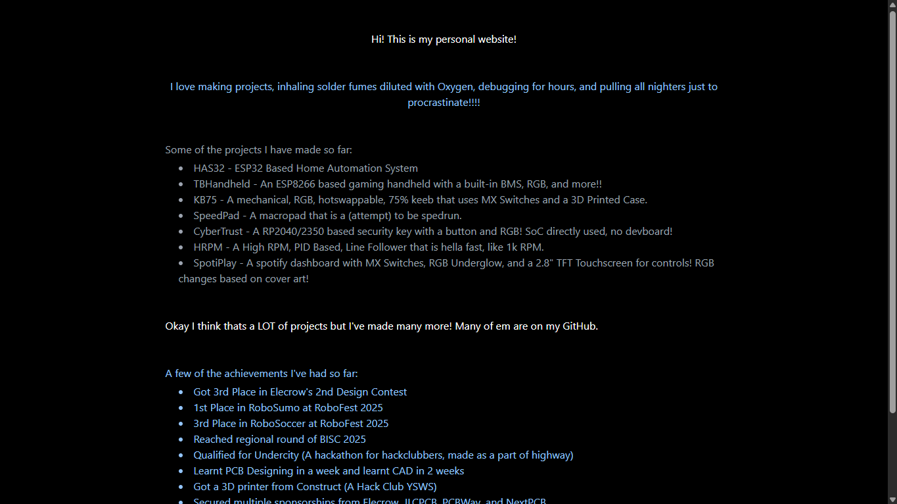

# First Website!

Hi!!! This is the first website I have ever built! Damn I thought HTML was hard but it's very **very very easy**! I learnt alot off of this like what Tailwind really is, how to use it, and ofc how to code HTML Sites in general lol. 

Right now the website isn't polished or stuff but I made this just to learn HTML and Tailwind so that I can make other websites, like I am gonna make a 3D Print ordersing site that communicates directly with printago API to automate prints that customers order from me. Idk what else to write so yeah, byeeee!

## Why I made it?
I made it because there are so many ppl in slac that have their own site but I didn't s I decided to make this and i also rlly wanted to learn HTML.

## Tech Stack
HTML and Tailwind CSS!

## Preview

